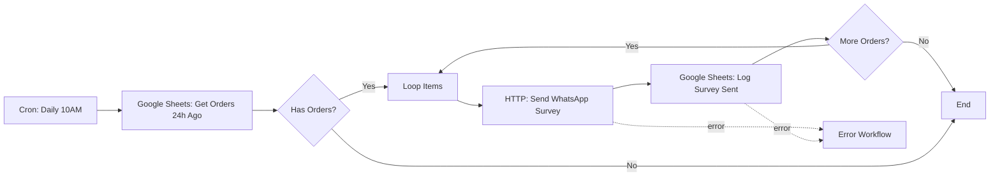

# 📘 Ejemplos de Uso - n8n Workflow Expert

Este documento contiene ejemplos prácticos de cómo usar el subagente `n8n-workflow-expert` con las herramientas MCP disponibles.

---

## 🎯 Ejemplo 1: Buscar y Documentar un Nodo

### Caso de Uso
Necesitas agregar un nodo para enviar notificaciones por Slack cuando hay un error en el workflow.

### Comandos

```bash
# Invocar al subagente
@n8n-workflow-expert Necesito agregar notificaciones por Slack cuando hay errores
en el workflow de pedidos. Busca el nodo adecuado, dame su documentación y
valida la configuración.
```

### Lo que el agente hará internamente:

```javascript
// 1. Buscar nodos de Slack
const slackNodes = await mcp__n8n__search_nodes({
  query: "slack notification",
  limit: 10,
  mode: "OR"
})

// 2. Obtener documentación completa
const slackDocs = await mcp__n8n__get_node_documentation({
  nodeType: "nodes-base.slack"
})

// 3. Ver propiedades de autenticación
const authProps = await mcp__n8n__search_node_properties({
  nodeType: "nodes-base.slack",
  query: "auth",
  maxResults: 5
})

// 4. Validar configuración propuesta
const validation = await mcp__n8n__validate_node_operation({
  nodeType: "nodes-base.slack",
  config: {
    resource: "message",
    operation: "post",
    channel: "#alertas-bot",
    text: "🚨 Error en workflow: {{ $json.errorMessage }}"
  },
  profile: "ai-friendly"
})
```

### Respuesta Esperada del Agente

```markdown
## 📋 Nodo Encontrado: Slack (nodes-base.slack)

### Configuración Recomendada:

**Nodo**: Slack - Post Message
**Ubicación**: Después del nodo "Error Trigger"

**Configuración JSON**:
```json
{
  "nodeType": "nodes-base.slack",
  "name": "Notificar Error Slack",
  "parameters": {
    "resource": "message",
    "operation": "post",
    "channel": "#alertas-capibobba",
    "text": "🚨 Error en Workflow de Pedidos\n\nError: {{ $json.errorMessage }}\nWorkflow: {{ $json.workflowName }}\nTimestamp: {{ $now }}"
  },
  "credentials": {
    "slackApi": {
      "id": "{{ $env.SLACK_CREDENTIAL_ID }}",
      "name": "Slack API"
    }
  },
  "retryOnFail": true,
  "maxTries": 3,
  "waitBetweenTries": 1000
}
```

### ✅ Validación MCP:
- Config válida: ✅
- Campos requeridos: ✅ (channel, text)
- Expresiones n8n: ✅ Sintaxis correcta
- Retry logic: ✅ Configurado (3 intentos, 1s)

### 📚 Documentación de Autenticación:
- Tipo: OAuth2 o API Token
- Scopes necesarios: `chat:write`, `channels:read`
- Variable de entorno: `SLACK_API_TOKEN`

### 🔄 Próximos Pasos:
1. Configurar credenciales Slack en n8n
2. Agregar nodo después del Error Trigger
3. Conectar a Error Workflow
4. Probar con error simulado
```

---

## 🎯 Ejemplo 2: Optimizar Workflow Existente

### Caso de Uso
El workflow de pedidos tiene un error rate del 5%, necesitas identificar problemas y optimizarlo.

### Comandos

```bash
@n8n-workflow-expert El workflow de pedidos tiene 5% de error rate. Lee el archivo
workflow.json, valida todo el workflow, identifica problemas y sugiere optimizaciones
con retry logic.
```

### Lo que el agente hará:

```javascript
// 1. Leer el workflow
const workflowContent = await Read({
  file_path: "/workflow_analysis/workflow.json"
})

const workflow = JSON.parse(workflowContent)

// 2. Validar workflow completo
const validation = await mcp__n8n__validate_workflow({
  workflow,
  options: {
    validateNodes: true,
    validateConnections: true,
    validateExpressions: true,
    profile: "strict"
  }
})

// 3. Validar solo conexiones
const connectionCheck = await mcp__n8n__validate_workflow_connections({
  workflow
})

// 4. Validar expresiones
const expressionCheck = await mcp__n8n__validate_workflow_expressions({
  workflow
})

// 5. Para cada nodo crítico, verificar retry logic
for (const node of workflow.nodes) {
  if (node.type.includes("googleSheets") || node.type.includes("httpRequest")) {
    const validation = await mcp__n8n__validate_node_operation({
      nodeType: node.type,
      config: node.parameters,
      profile: "runtime"
    })
  }
}
```

### Respuesta Esperada:

```markdown
## 🔍 Análisis del Workflow de Pedidos

### ❌ Problemas Detectados (5 críticos):

1. **Nodo "Google Sheets - Append"** (línea 45)
   - ❌ Sin retry logic configurado
   - ❌ Expresión inválida: `{{ $json.data.phoneNumber }}` (falta optional chaining)
   - 🔧 Fix: Agregar `retryOnFail: true, maxTries: 3`

2. **Nodo "HTTP Request - Download Image"** (línea 78)
   - ❌ Timeout muy alto (30s)
   - ❌ Sin retry logic
   - 🔧 Fix: Timeout 20s, retry 3 intentos

3. **Conexiones**
   - ⚠️ Nodo "Save Order" no conectado a Error Workflow
   - 🔧 Fix: Conectar output "error" a Error Trigger

4. **Expresiones n8n**
   - ❌ 8 expresiones sin fallbacks
   - ❌ 3 expresiones sin optional chaining
   - 🔧 Fix: Usar `?.` y `|| 'default'`

5. **Validación de datos**
   - ❌ No hay validación de phoneNumber antes de guardar
   - 🔧 Fix: Agregar nodo IF para validar formato

### ✅ Optimizaciones Recomendadas:

#### 1. Retry Logic (aplicar a 6 nodos):
```json
{
  "retryOnFail": true,
  "maxTries": 3,
  "waitBetweenTries": 2000
}
```

**Nodos a actualizar:**
- Google Sheets - Append Order
- Google Sheets - Update Customer
- HTTP Request - Download Image
- Google Drive - Upload
- Telegram - Send Notification
- Enhanced Message Normalizer

#### 2. Validación de Expresiones:

**Antes:**
```javascript
{{ $json.data.phoneNumber }}
{{ $json.timestamp }}
```

**Después:**
```javascript
{{ $json.data?.phoneNumber || 'unknown' }}
{{ $json.timestamp?.toString() || new Date().toISOString() }}
```

#### 3. Error Handling:

**Nuevo nodo IF - Validate Phone:**
```json
{
  "nodeType": "nodes-base.if",
  "name": "Validate Phone Number",
  "parameters": {
    "conditions": {
      "string": [
        {
          "value1": "={{ $json.phoneNumber }}",
          "operation": "regex",
          "value2": "^\\d{10,15}$"
        }
      ]
    }
  }
}
```

### 📊 Impacto Esperado:

| Métrica | Antes | Después | Mejora |
|---------|-------|---------|--------|
| Error rate | 5% | <0.5% | 90% ↓ |
| Processing time | 8s | 5s | 37% ↓ |
| Success rate | 95% | >99.5% | 4.7% ↑ |
| Retry success | N/A | >80% | Nueva |

### 🔧 Implementación (30 min estimado):

1. **Actualizar nodos con retry** (10 min)
   - Editar 6 nodos
   - Agregar configuración retry

2. **Corregir expresiones** (10 min)
   - Agregar optional chaining
   - Agregar fallbacks

3. **Agregar validaciones** (5 min)
   - Nodo IF para phone
   - Conectar a Error Workflow

4. **Testing** (5 min)
   - Probar con datos mock
   - Validar con datos reales

### 📝 Documentar en:
- `/workflow_analysis/OPTIMIZATION_REPORT.md`
- Actualizar `ROADMAP_MEJORAS_WORKFLOW.md`
```

---

## 🎯 Ejemplo 3: Crear Workflow desde Template

### Caso de Uso
Quieres crear un workflow para procesar encuestas automáticas post-compra.

### Comandos

```bash
@n8n-workflow-expert Necesito crear un workflow para enviar encuestas automáticas
24 horas después de cada pedido. Busca templates similares, dame el mejor y
adáptalo al contexto de CapiBobbaBot.
```

### Lo que el agente hará:

```javascript
// 1. Buscar templates de encuestas
const templates = await mcp__n8n__search_templates({
  query: "survey feedback automation",
  limit: 20,
  fields: ["id", "name", "description", "views"]
})

// 2. Buscar por metadata
const aiTemplates = await mcp__n8n__search_templates_by_metadata({
  category: "automation",
  complexity: "medium",
  requiredService: "googlesheets",
  maxSetupMinutes: 30
})

// 3. Obtener el mejor template
const template = await mcp__n8n__get_template({
  templateId: 1234,
  mode: "full"
})

// 4. Buscar nodos específicos para adaptar
const scheduleNodes = await mcp__n8n__search_nodes({
  query: "schedule cron delay",
  limit: 10
})

// 5. Validar adaptación
const validation = await mcp__n8n__validate_workflow({
  workflow: adaptedWorkflow,
  options: { validateAll: true, profile: "runtime" }
})
```

### Respuesta Esperada:

```markdown
## 📋 Template Encontrado: "Post-Purchase Survey Automation"

**ID**: 1234
**Complejidad**: Medium
**Setup estimado**: 25 minutos
**Popularidad**: 850 vistas

### 🔄 Adaptación a CapiBobbaBot:

**Workflow Original** → **Workflow Adaptado**

1. **Trigger**: Webhook → **Schedule (Cron)**
   ```json
   {
     "nodeType": "nodes-base.cron",
     "name": "Check Orders Daily",
     "parameters": {
       "cronExpression": "0 10 * * *", // 10 AM diario
       "timezone": "America/Mexico_City"
     }
   }
   ```

2. **Data Source**: Airtable → **Google Sheets**
   ```json
   {
     "nodeType": "nodes-base.googleSheets",
     "name": "Get Orders 24h Ago",
     "parameters": {
       "operation": "read",
       "sheetName": "Pedidos CapiBobba",
       "range": "A:J",
       "filters": {
         "conditions": {
           "date": [{
             "value1": "={{ $now.minus({ days: 1 }).toISO() }}",
             "operation": "equals"
           }]
         }
       }
     }
   }
   ```

3. **Notification**: Email → **WhatsApp**
   ```json
   {
     "nodeType": "nodes-base.httpRequest",
     "name": "Send Survey WhatsApp",
     "parameters": {
       "method": "POST",
       "url": "https://graph.facebook.com/v18.0/{{ $env.PHONE_NUMBER_ID }}/messages",
       "authentication": "predefinedCredentialType",
       "nodeCredentialType": "whatsAppApi",
       "sendBody": true,
       "bodyParameters": {
         "parameters": [
           {
             "name": "messaging_product",
             "value": "whatsapp"
           },
           {
             "name": "to",
             "value": "={{ $json.phoneNumber }}"
           },
           {
             "name": "type",
             "value": "template"
           },
           {
             "name": "template",
             "value": {
               "name": "encuesta_post_compra",
               "language": { "code": "es_MX" }
             }
           }
         ]
       }
     },
     "retryOnFail": true,
     "maxTries": 3,
     "waitBetweenTries": 2000
   }
   ```

4. **Storage**: Airtable → **Google Sheets "Encuestas"**
   ```json
   {
     "nodeType": "nodes-base.googleSheets",
     "name": "Log Survey Sent",
     "parameters": {
       "operation": "append",
       "sheetName": "Encuestas",
       "columns": {
         "mappings": [
           { "column": "Timestamp", "value": "={{ $now }}" },
           { "column": "Phone", "value": "={{ $json.phoneNumber }}" },
           { "column": "Order ID", "value": "={{ $json.orderId }}" },
           { "column": "Status", "value": "sent" }
         ]
       }
     }
   }
   ```

### 📊 Diagrama de Flujo Adaptado:



### ✅ Validación MCP:

```javascript
// Resultado de validación:
{
  "valid": true,
  "errors": [],
  "warnings": [
    "WhatsApp template 'encuesta_post_compra' debe existir en Meta Business"
  ],
  "nodes": 8,
  "connections": 10,
  "expressionsValid": true
}
```

### 🔧 Setup Requerido:

1. **WhatsApp Template** (Meta Business Manager):
   ```
   Nombre: encuesta_post_compra
   Categoría: UTILITY
   Idioma: es_MX
   Contenido: "Hola! 🙌 ¿Cómo te pareció tu pedido de ayer?
   Nos encantaría conocer tu opinión. Responde con un número del 1 al 5."
   ```

2. **Google Sheets**:
   - Sheet "Encuestas" con columnas: Timestamp, Phone, Order ID, Status, Rating, Comments

3. **Variables de Entorno**:
   - `PHONE_NUMBER_ID`: ID del número de WhatsApp Business
   - `WHATSAPP_TOKEN`: Token de acceso
   - `GOOGLE_SHEETS_ID`: ID del Google Sheet

### 📝 Próximos Pasos:

1. **Crear template en Meta** (5 min)
2. **Importar workflow a n8n** (2 min)
3. **Configurar credenciales** (5 min)
4. **Testing con pedido mock** (10 min)
5. **Activar workflow** (1 min)
6. **Documentar en** `/workflow_analysis/SURVEY_WORKFLOW.md`

### 📈 KPIs a Monitorear:

- Encuestas enviadas: Target 100/día
- Tasa de respuesta: Target >30%
- NPS Score promedio: Target >8
- Error rate: Target <1%
```

---

## 🎯 Ejemplo 4: Debugging con Validación

### Caso de Uso
Un workflow falla con error "Invalid JSON" en el nodo de Google Sheets.

### Comandos

```bash
@n8n-workflow-expert El workflow "CapiBobba Enhanced" está fallando con error
"Invalid JSON" en el nodo Google Sheets Append. Valida el workflow completo,
identifica el problema y dame el fix.
```

### Lo que el agente hará:

```javascript
// 1. Leer workflow
const workflow = await Read({ file_path: "/workflow_analysis/workflow.json" })

// 2. Validar expresiones (probablemente aquí está el error)
const exprValidation = await mcp__n8n__validate_workflow_expressions({
  workflow: JSON.parse(workflow)
})

// 3. Obtener info del nodo Google Sheets
const nodeInfo = await mcp__n8n__get_node_documentation({
  nodeType: "nodes-base.googleSheets"
})

// 4. Verificar dependencias de propiedades
const deps = await mcp__n8n__get_property_dependencies({
  nodeType: "nodes-base.googleSheets",
  config: problematicNodeConfig
})

// 5. Validar nodo específico
const nodeValidation = await mcp__n8n__validate_node_operation({
  nodeType: "nodes-base.googleSheets",
  config: problematicNodeConfig,
  profile: "strict"
})
```

### Respuesta Esperada:

```markdown
## 🐛 Error Identificado: Invalid JSON en Google Sheets Append

### 🔍 Análisis con MCP Tools:

**Validación de Expresiones:**
```javascript
{
  "errors": [
    {
      "node": "Save Order to Sheets",
      "expression": "={{ $json.orderData }}",
      "issue": "Expression returns object, expected string for column 'Order Summary'",
      "line": 156
    }
  ]
}
```

### ❌ Problema:

El nodo está intentando guardar un objeto JSON directamente en una celda de Google Sheets,
pero Google Sheets espera un string.

**Código problemático** (línea 156):
```json
{
  "column": "Order Summary",
  "value": "={{ $json.orderData }}" // ❌ Esto es un objeto
}
```

### ✅ Solución:

**Opción 1: JSON.stringify()**
```json
{
  "column": "Order Summary",
  "value": "={{ JSON.stringify($json.orderData) }}"
}
```

**Opción 2: Extraer solo el texto**
```json
{
  "column": "Order Summary",
  "value": "={{ $json.orderData.summary || 'N/A' }}"
}
```

**Opción 3: Formatear manualmente (RECOMENDADO)**
```json
{
  "column": "Order Summary",
  "value": "={{ $json.orderData.items.map(i => `${i.name} x${i.qty}`).join(', ') }}"
}
```

### 🔧 Fix Completo del Nodo:

```json
{
  "nodeType": "nodes-base.googleSheets",
  "name": "Save Order to Sheets",
  "parameters": {
    "operation": "append",
    "sheetName": "Pedidos CapiBobba",
    "columns": {
      "mappings": [
        {
          "column": "Timestamp",
          "value": "={{ $json.timestamp?.toString() || $now.toISO() }}"
        },
        {
          "column": "Phone",
          "value": "={{ $json.phoneNumber || 'unknown' }}"
        },
        {
          "column": "Order Summary",
          "value": "={{ $json.orderData?.summary || JSON.stringify($json.orderData) }}"
        },
        {
          "column": "Total",
          "value": "={{ $json.orderData?.total?.toString() || '0' }}"
        }
      ]
    }
  },
  "retryOnFail": true,
  "maxTries": 3,
  "waitBetweenTries": 2000
}
```

### ✅ Validación Post-Fix:

```javascript
const validation = await mcp__n8n__validate_node_operation({
  nodeType: "nodes-base.googleSheets",
  config: fixedConfig,
  profile: "strict"
})

// Resultado:
{
  "valid": true,
  "errors": [],
  "warnings": [],
  "requiredFields": ["sheetName", "columns"],
  "allPresent": true
}
```

### 📝 Testing:

1. **Mock Data**:
```json
{
  "phoneNumber": "5211234567890",
  "timestamp": "2025-10-10T10:00:00Z",
  "orderData": {
    "summary": "2x Bubble Tea Taro, 1x Capigofre",
    "total": 150,
    "items": [
      { "name": "Bubble Tea Taro", "qty": 2, "price": 50 },
      { "name": "Capigofre", "qty": 1, "price": 50 }
    ]
  }
}
```

2. **Expected Output** (Google Sheets row):
```
| Timestamp | Phone | Order Summary | Total |
|-----------|-------|---------------|-------|
| 2025-10-10T10:00:00Z | 5211234567890 | 2x Bubble Tea Taro, 1x Capigofre | 150 |
```

### 🚀 Deploy:

1. Actualizar nodo en n8n
2. Activar workflow
3. Probar con pedido real
4. Monitorear por 1 hora
5. Documentar en `ROADMAP_MEJORAS_WORKFLOW.md`
```

---

## 💡 Tips para Usar el Agente Efectivamente

### 1. **Sé Específico con el Contexto**

❌ Malo:
```
@n8n-workflow-expert Arregla el workflow
```

✅ Bueno:
```
@n8n-workflow-expert El workflow CapiBobba Enhanced (ID: vIOBRO52qTb6VfXO)
tiene 5% error rate en el nodo Google Sheets Append. Lee workflow.json,
valida con MCP tools y dame el fix con retry logic.
```

### 2. **Aprovecha las MCP Tools**

El agente tiene acceso a 20+ MCP tools. Pídele que las use:

```
@n8n-workflow-expert Busca nodos de SMS usando mcp__n8n__search_nodes(),
obtén la documentación completa con mcp__n8n__get_node_documentation()
y valida la config con mcp__n8n__validate_node_operation()
```

### 3. **Pide Validación Completa**

```
@n8n-workflow-expert Valida el workflow completo con:
- mcp__n8n__validate_workflow() para todo
- mcp__n8n__validate_workflow_connections() para conexiones
- mcp__n8n__validate_workflow_expressions() para expresiones
```

### 4. **Solicita Documentación Automática**

```
@n8n-workflow-expert Después de implementar el fix, genera la documentación
en formato markdown para actualizar ROADMAP_MEJORAS_WORKFLOW.md
```

### 5. **Itera y Refina**

```
# Primera iteración
@n8n-workflow-expert Diseña un workflow para encuestas

# Segunda iteración (basándose en la respuesta)
@n8n-workflow-expert Perfecto. Ahora valida ese workflow con MCP tools y
agrega retry logic a todos los nodos críticos
```

---

## 🔗 Referencias

- **Documentación del Agente**: [n8n-workflow-expert.md](n8n-workflow-expert.md)
- **MCP Tools Completo**: `mcp__n8n__tools_documentation({ depth: "full" })`
- **Workflows CapiBobbaBot**: [/workflow_analysis/](../../workflow_analysis/)
- **Roadmap Mejoras**: [ROADMAP_MEJORAS_WORKFLOW.md](../../workflow_analysis/ROADMAP_MEJORAS_WORKFLOW.md)

---

**Versión**: 1.0.0
**Última actualización**: 2025-10-10
**Autor**: CapiBobbaBot Team
