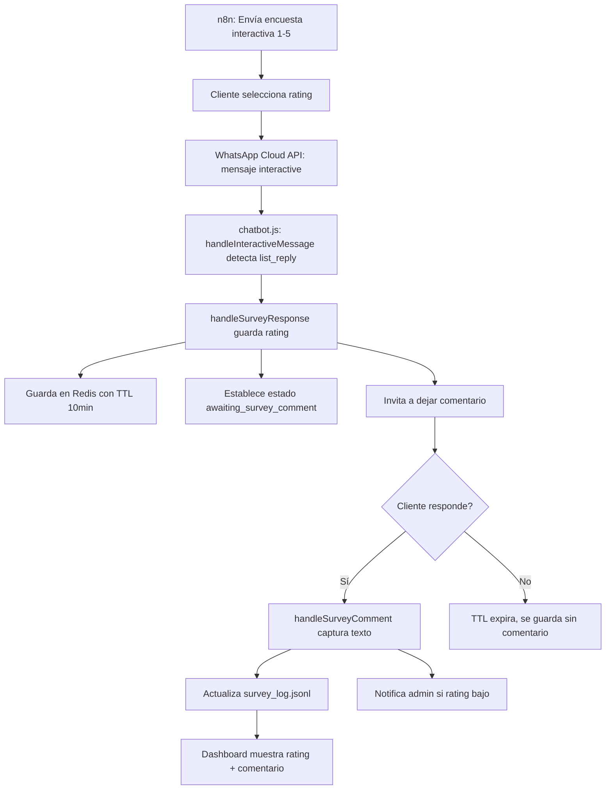

# 📊 Implementación de Encuestas Interactivas con Comentarios

**Fecha**: 11 de Octubre, 2025
**Versión**: v2.12.2
**Status**: ✅ IMPLEMENTADO

---

## 🎯 Objetivo

Solucionar la discrepancia entre el sistema de envío de encuestas (n8n) y el sistema de recepción (chatbot.js), e implementar captura de comentarios para análisis de sentimientos.

---

## 🚨 Problema Identificado

### **Discrepancia Crítica**:

1. **Nodo n8n** enviaba mensajes interactivos de WhatsApp (lista con botones) con escala 1-5
2. **chatbot.js** esperaba mensajes de texto plano y detectaba escala 0-5
3. **Resultado**: Las respuestas de encuestas NO se procesaban correctamente

### **Flujo Roto**:
```
Cliente selecciona "⭐⭐⭐⭐⭐ (5)"
  ↓
WhatsApp envía mensaje tipo "interactive"
  ↓
chatbot.js busca message.text.body ❌ (no existe)
  ↓
Encuesta NO se guarda ❌
```

---

## ✅ Solución Implementada

### **1. Actualización del Nodo n8n** ([n8n-nodes-encuestacapibobba/nodes/EncuestaCapiBobba/EncuestaCapiBobba.node.ts:83](n8n-nodes-encuestacapibobba/nodes/EncuestaCapiBobba/EncuestaCapiBobba.node.ts#L83))

**Cambio**: Agregado mensaje invitando a comentarios

```typescript
const body = `¡Hola! Soy CapiBot, de CapiBobba 💜.

Noté que disfrutaste de un pedido con nosotros el ${fecha}. ¡Esperamos que te haya encantado!

Para mejorar, ¿podrías calificar tu experiencia?

💬 *Opcional*: Después de calificar, puedes enviarnos un comentario sobre tu experiencia. ¡Tu opinión es muy importante para nosotros!`;
```

---

### **2. Detección de Mensajes Interactivos** ([chatbot.js:1330-1344](chatbot.js#L1330-L1344))

**Nuevo código en `handleInteractiveMessage()`**:

```javascript
// Manejar respuestas de lista (encuestas)
if (interactive.type === 'list_reply') {
    const listReplyId = interactive.list_reply?.id;
    const listReplyTitle = interactive.list_reply?.title;

    console.log(`📋 Lista respondida: ${listReplyId} - ${listReplyTitle}`);

    // Detectar si es una respuesta de encuesta
    if (listReplyId && listReplyId.startsWith('rating_')) {
        const rating = parseInt(listReplyId.replace('rating_', ''));
        console.log(`⭐ Calificación de encuesta detectada: ${rating}`);
        await handleSurveyResponse(from, rating);
        return;
    }
}
```

**Impacto**: Ahora chatbot.js detecta correctamente respuestas de botones de WhatsApp

---

### **3. Actualización a Escala 1-5** ([chatbot.js:1736](chatbot.js#L1736))

**Antes**:
```javascript
const ratingMatch = cleanText.match(/^[0-5]$/); // ❌ Permitía 0
```

**Después**:
```javascript
const ratingMatch = cleanText.match(/^[1-5]$/); // ✅ Solo 1-5
```

**También actualizado en**:
- [chatbot.js:3374](chatbot.js#L3374) - `ratingCounts` ahora es `{ 1: 0, 2: 0, 3: 0, 4: 0, 5: 0 }`
- [chatbot.js:3386](chatbot.js#L3386) - Detractores ahora son rating 1-2 (antes 0-2)

---

### **4. Sistema de Comentarios** ([chatbot.js:1845-1943](chatbot.js#L1845-L1943))

#### **4.1 Solicitud de Comentarios**

Función `handleSurveyResponse()` ahora:
1. Guarda rating en Redis con TTL de 10 minutos
2. Establece estado `awaiting_survey_comment`
3. Invita al usuario a dejar un comentario según su calificación

```javascript
// Establecer estado del usuario para detectar comentarios posteriores
await setUserState(from, {
  step: 'awaiting_survey_comment',
  surveyRating: rating,
  surveyTimestamp: surveyData.timestamp
});
```

**Mensajes personalizados**:
- **Rating 1-2** (Insatisfecho): *"Lamentamos mucho... ¿Te gustaría contarnos qué podríamos mejorar?"*
- **Rating 3** (Neutral): *"¿Hay algo específico que te gustaría que mejoráramos?"*
- **Rating 4-5** (Satisfecho): *"Si deseas, puedes enviarnos un comentario adicional..."*

#### **4.2 Captura de Comentarios**

Nueva función `handleSurveyComment()` ([chatbot.js:1895-1943](chatbot.js#L1895-L1943)):

```javascript
async function handleSurveyComment(from, text, userState) {
  // Recuperar encuesta pendiente de Redis
  const surveyKey = `survey_pending:${from}`;
  const pendingSurveyData = await redisClient.get(surveyKey);

  if (pendingSurveyData) {
    const surveyData = JSON.parse(pendingSurveyData);
    surveyData.comment = text;
    surveyData.commentTimestamp = new Date().toISOString();

    // Actualizar el log con el comentario
    logSurveyResponseToFile(surveyData);
  }

  // Notificar a admin si es rating bajo o comentario largo
  if (userState.surveyRating <= 2 || text.length > 50) {
    await notifyAdmin(/* ... */);
  }
}
```

#### **4.3 Detección Automática**

Agregado caso en `handleTextMessage()` ([chatbot.js:1268-1270](chatbot.js#L1268-L1270)):

```javascript
case 'awaiting_survey_comment':
    await handleSurveyComment(from, text, userState);
    return;
```

---

### **5. Actualización de API** ([chatbot.js:3434-3439](chatbot.js#L3434-L3439))

Endpoint `/api/survey/results` ahora incluye comentarios:

```javascript
const recentSurveys = allSurveys
  .slice(-10)
  .reverse()
  .map(survey => ({
    rating: survey.rating,
    from: survey.from,
    timestamp: survey.timestamp || new Date().toISOString(),
    comment: survey.comment || null,              // ✅ NUEVO
    commentTimestamp: survey.commentTimestamp || null  // ✅ NUEVO
  }));
```

---

## 📊 Formato de Datos

### **survey_log.jsonl**

```jsonl
{"from":"521234567890","rating":5,"timestamp":"2025-10-11T14:30:00.000Z","comment":null}
{"from":"521234567890","rating":5,"timestamp":"2025-10-11T14:30:00.000Z","comment":"¡Excelente servicio y el bubble tea delicioso!","commentTimestamp":"2025-10-11T14:31:15.000Z"}
```

### **Redis Keys**

```
survey_pending:521234567890 (TTL: 600s)
{
  "from": "521234567890",
  "rating": 5,
  "timestamp": "2025-10-11T14:30:00.000Z",
  "comment": null
}
```

---

## 🔄 Flujo Completo



---

## 🎯 Preparación para Análisis de Sentimientos

Los comentarios ahora se capturan en `survey_log.jsonl` en formato estructurado, listos para ser procesados por:

### **Workflow n8n de Análisis de Sentimientos** (Próximo paso):

```
Trigger Schedule (cada 15 min)
  ↓
Lee survey_log.jsonl (últimos comentarios sin procesar)
  ↓
Filtra comentarios con text != null
  ↓
Google Gemini AI: Análisis de sentimiento
  ↓
Clasifica: Positivo / Neutral / Negativo
  ↓
Extrae: Temas clave (sabor, servicio, precio, entrega)
  ↓
Guarda en Google Sheets para dashboard
```

### **Estructura sugerida para análisis**:

```javascript
{
  "from": "521234567890",
  "rating": 2,
  "comment": "El bubble tea estaba bien pero la entrega tardó mucho",
  "sentiment": "negative",
  "topics": ["delivery_time", "product_quality"],
  "urgency": "medium",
  "processedAt": "2025-10-11T14:35:00.000Z"
}
```

---

## 📁 Archivos Modificados

| Archivo | Líneas | Cambios |
|---------|--------|---------|
| [n8n-nodes-encuestacapibobba/nodes/EncuestaCapiBobba/EncuestaCapiBobba.node.ts](n8n-nodes-encuestacapibobba/nodes/EncuestaCapiBobba/EncuestaCapiBobba.node.ts) | 83 | Agregada invitación a comentarios |
| [chatbot.js](chatbot.js) | 1330-1344 | Detección de mensajes interactivos de lista |
| [chatbot.js](chatbot.js) | 1268-1270 | Agregado caso `awaiting_survey_comment` |
| [chatbot.js](chatbot.js) | 1729-1750 | Actualizado regex de detección (1-5) |
| [chatbot.js](chatbot.js) | 1845-1943 | Nueva función `handleSurveyComment()` |
| [chatbot.js](chatbot.js) | 3374-3386 | Actualizado `ratingCounts` y NPS (escala 1-5) |
| [chatbot.js](chatbot.js) | 3424 | Actualizada distribución (sin rating 0) |
| [chatbot.js](chatbot.js) | 3434-3439 | API incluye comentarios en respuesta |

---

## ✅ Testing

### **Validaciones realizadas**:

1. ✅ **Sintaxis JavaScript**: `node --check chatbot.js` → Sin errores
2. ✅ **Compilación TypeScript**: `npm run build` en n8n-nodes-encuestacapibobba → Exitoso
3. ✅ **Lógica de detección**: Patrones regex actualizados de `[0-5]` a `[1-5]`
4. ✅ **Estados de Redis**: TTL de 600s para captura de comentarios
5. ✅ **API endpoints**: `/api/survey/results` retorna comentarios

### **Casos de uso cubiertos**:

- ✅ Cliente selecciona rating desde lista interactiva
- ✅ Cliente envía comentario después de calificar
- ✅ Cliente NO envía comentario (timeout de 10 min)
- ✅ Admin recibe notificación si rating ≤ 2 o comentario largo
- ✅ Dashboard recibe datos con comentarios
- ✅ NPS calculado correctamente con escala 1-5

---

## 🚀 Próximos Pasos

1. **Deploy a producción** (Render auto-deploy al push a main)
2. **Monitoreo post-deploy**:
   - Verificar logs en Render
   - Probar flujo completo de encuesta
   - Validar almacenamiento en `survey_log.jsonl`
3. **Implementar workflow de análisis de sentimientos en n8n**
4. **Actualizar dashboard** para mostrar comentarios destacados

---

## 📚 Referencias

- [SISTEMA_ENCUESTAS_RESUMEN.md](workflow_analysis/SISTEMA_ENCUESTAS_RESUMEN.md) - Análisis completo del sistema
- [ROADMAP_MEJORAS_WORKFLOW.md](workflow_analysis/ROADMAP_MEJORAS_WORKFLOW.md) - Mejoras pendientes
- [WhatsApp Cloud API v24.0](https://developers.facebook.com/docs/whatsapp/cloud-api/reference/messages#interactive-object) - Documentación de mensajes interactivos

---

**Implementado por**: Claude Code
**Revisión**: Pendiente por usuario
